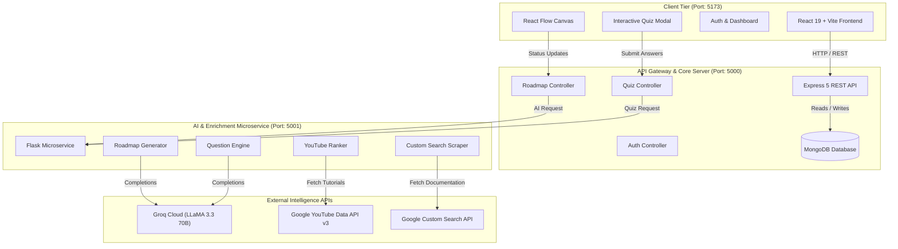
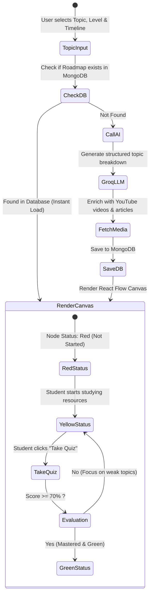

# 🗺️ DevMap - AI-Powered Developer Roadmap & Learning Platform

<p align="center">
  
</p>

<p align="center">
  <strong>Personalized, adaptive learning paths, interactive visual flowcharts, curated multimedia resources, and AI-driven skill assessments tailored to your career goals.</strong>
</p>

<p align="center">
  
  
  
  
  
  
  
  
  
  
</p>

---

## 📖 Table of Contents

- [Overview](#-overview)
- [Key Features](#-key-features)
- [System Architecture](#-system-architecture)
- [Tech Stack](#-tech-stack)
- [Project Directory Structure](#-project-directory-structure)
- [Getting Started](#-getting-started)
  - [Prerequisites](#prerequisites)
  - [1. Clone Repository](#1-clone-repository)
  - [2. AI Service Setup](#2-ai-service-setup-flask--groq)
  - [3. Backend Setup](#3-backend-setup-nodejs--express)
  - [4. Frontend Setup](#4-frontend-setup-react--vite)
- [Environment Configuration](#-environment-configuration)
- [API Endpoints Reference](#-api-endpoints-reference)
- [Roadmap Lifecycle & Status Flow](#-roadmap-lifecycle--status-flow)
- [Future Scope](#-future-scope)
- [Contributing](#-contributing)
- [License](#-license)

---

## 🌟 Overview

**DevMap** is a full-stack, AI-orchestrated learning management and developer guidance platform designed to eliminate learning paralysis. Instead of sifting through thousands of scattered tutorials and outdated guides, learners enter any topic (e.g. *Full Stack Web Development*, *Kubernetes & Cloud Engineering*, *Large Language Models*, *DSA & System Design*), select their target proficiency level, and pick their available time horizon.

DevMap dynamically:
1. **Synthesizes a structured curriculum** categorized by modules, topics, and subtopics.
2. **Visualizes the curriculum as an interactive node graph** powered by React Flow with zoom, pan, and collapsible views.
3. **Gathers high-quality educational resources** by querying the YouTube Data API for tutorials and Google Custom Search for articles and documentation.
4. **Validates learner competence with AI-generated quizzes** (Groq LLaMA 3.3 70B), tracking mistakes and updating topic mastery in real time.

---

## ✨ Key Features

- 🗺️ **Adaptive AI Roadmap Engine**: Generates end-to-end milestone breakdowns tailored to skill level (*Beginner*, *Intermediate*, *Advanced*) and timeframe (*1 Month*, *3 Months*, *6 Months*).
- 📊 **Interactive Flowchart Canvas**: Dynamic visualization built with React Flow, supporting smooth dragging, panning, responsive node connections, and active topic focus.
- 🚦 **Real-Time Progress Tracking**: Color-coded nodes reflecting topic status:
  - 🔴 **Red (Not Started)**: Initial state for pending milestones.
  - 🟡 **Yellow (In Progress)**: Topics currently being studied or partially completed.
  - 🟢 **Green (Completed)**: Topics marked finished or mastered via passing quiz score.
- 🎬 **Automated Resource Aggregator**:
  - Automatically fetches the most relevant tutorial videos via **YouTube Data API v3**.
  - Dynamically retrieves top authoritative articles and official documentation via **Google Custom Search Engine**.
- 🧠 **AI Skill Assessments & Diagnostic Quizzes**:
  - On-demand 10-question multiple-choice quizzes generated dynamically for any roadmap node.
  - Instant scoring with a 70% passing threshold.
  - Detailed diagnostic feedback identifying specific weak areas and subtopics to review.
  - Automated status updates to the roadmap on quiz completion.
- 🔐 **Authentication & Account Management**:
  - Secure registration and login with encrypted credentials using `bcrypt`.
  - Self-service password recovery and password reset workflow.
- 📈 **Personalized Learner Dashboard**:
  - View all previously generated and saved roadmaps.
  - Quickly resume learning journeys without re-querying the AI service.
  - Track total roadmaps generated, completed steps, and quiz attempts.
- 💬 **Integrated Contact & Feedback Channel**: Direct feedback submission pipeline backed by persistent storage.

---

## 🏗️ System Architecture



---

## 💻 Tech Stack

### Frontend
- **Framework**: [React 19](https://react.dev/) + [Vite 8](https://vitejs.dev/)
- **Visual Graph**: [React Flow](https://reactflow.dev/)
- **Routing**: [React Router DOM v7](https://reactrouter.com/)
- **Styling**: [Tailwind CSS v4](https://tailwindcss.com/)
- **Icons**: [React Icons](https://react-icons.github.io/react-icons/)

### Backend
- **Runtime**: [Node.js](https://nodejs.org/) (v18+ / v22+)
- **Server Framework**: [Express 5](https://expressjs.com/)
- **Database**: [MongoDB](https://www.mongodb.com/) via [Mongoose 9](https://mongoosejs.com/)
- **Security**: [bcrypt](https://github.com/kelektiv/node.bcrypt.js)
- **HTTP Client**: [Axios](https://axios-http.com/)
- **Environment**: [dotenv](https://github.com/motdotla/dotenv)

### AI Service
- **Language**: [Python 3.11+](https://www.python.org/)
- **Framework**: [Flask 3](https://flask.palletsprojects.com/) + [Flask-CORS](https://flask-cors.readthedocs.io/)
- **LLM Provider**: [Groq Cloud](https://groq.com/) running `llama-3.3-70b-versatile`
- **Search & Media APIs**:
  - Google YouTube Data API v3
  - Google Custom Search JSON API

---

## 📁 Project Directory Structure

```
DevMap/
├── ai-service/                   # Python Flask AI & scraping microservice
│   ├── quiz/                     # AI Quiz generation & evaluation
│   │   ├── prompts/              # Quiz system & user prompts
│   │   ├── utils/                # Groq client wrapper for quiz
│   │   ├── question_engine.py    # Unique question generator & JSON cleaner
│   │   └── result_analyzer.py    # Score & weak-point evaluator
│   ├── roadmap/                  # AI Roadmap generation & enrichment
│   │   ├── service/              # External search integrations
│   │   │   ├── web_search.py     # Google Custom Search API integration
│   │   │   └── youtube_ranker.py # YouTube Data API integration
│   │   ├── groq_client.py        # Groq API caller for roadmaps
│   │   ├── resource_engine.py    # Attaches media links to nodes
│   │   ├── roadmap_parser.py     # JSON extractor and validator
│   │   └── system_prompt.py      # Structured JSON prompt instructions
│   ├── app.py                    # Flask application entry point (Port 5001)
│   ├── requirements.txt          # Python package requirements
│   ├── .env.example              # AI service environment template
│   └── .gitignore
│
├── backend/                      # Node.js / Express REST API
│   ├── config/                   # Database connection configuration
│   ├── controllers/              # Route controller handlers
│   │   ├── QuizCont.js           # Quiz generation, grading & progress updates
│   │   └── roadmapController.js  # Roadmap persistence & node updates
│   ├── models/                   # Mongoose schemas
│   │   ├── Contact.js            # Feedback / message schema
│   │   ├── Quiz.js               # Saved quiz schema
│   │   ├── QuizAttempt.js        # User quiz score & answers schema
│   │   ├── Roadmap.js            # Structured roadmap document
│   │   └── User.js               # User account schema
│   ├── routes/                   # Express route definitions
│   │   ├── auth.js               # Signup, login, password reset
│   │   ├── contactRoutes.js      # Contact message endpoint
│   │   ├── quizRoutes.js         # Quiz generation & submission
│   │   └── roadmapRoutes.js      # Roadmap creation, fetch, and updates
│   ├── services/
│   │   └── aiService.js          # HTTP proxy to Flask AI Service
│   ├── server.js                 # Express server entry point (Port 5000)
│   ├── package.json
│   ├── .env.example              # Backend environment template
│   └── .gitignore
│
├── frontend/                     # React 19 + Vite single page application
│   ├── public/                   # Static assets & SVG icons
│   ├── src/
│   │   ├── assets/               # Brand artwork & images
│   │   ├── components/           # Reusable UI components
│   │   │   ├── CTA.jsx           # Call-to-action banner
│   │   │   ├── Features.jsx      # Feature showcase cards
│   │   │   ├── Footer.jsx        # Footer component
│   │   │   ├── GenerateRoadmapModal.jsx # Roadmap creation dialog
│   │   │   ├── Hero.jsx          # Landing page hero
│   │   │   ├── HowItWorks.jsx    # Step-by-step workflow guide
│   │   │   └── Navbar.jsx        # Navigation header
│   │   ├── pages/                # Routed views
│   │   │   ├── Contact.jsx       # Contact & support page
│   │   │   ├── Dashboard.jsx     # User dashboard & saved roadmaps
│   │   │   ├── ForgotPassword.jsx
│   │   │   ├── Home.jsx          # Public landing page
│   │   │   ├── Login.jsx         # User login page
│   │   │   ├── ResetPassword.jsx # Password reset form
│   │   │   ├── Roadmap.jsx       # Interactive React Flow roadmap canvas
│   │   │   └── Signup.jsx        # User registration page
│   │   ├── services/             # Client API wrappers (roadmapApi.js)
│   │   ├── App.jsx               # Main React router configuration
│   │   ├── index.css             # Tailwind CSS styles
│   │   └── main.jsx              # React DOM entry point
│   ├── package.json
│   ├── vite.config.js
│   ├── .env.example              # Frontend environment template
│   └── .gitignore
│
├── .gitignore                    # Global git ignore configuration
└── README.md                     # Project documentation
```

---

## 🚀 Getting Started

### Prerequisites

Ensure you have the following installed on your system:
- **Node.js**: v18.0.0 or later (v20+ / v22+ recommended)
- **Python**: v3.10 or later (v3.11+ recommended)
- **npm** or **pnpm** / **yarn**
- **MongoDB**: Local MongoDB instance or free cloud cluster at [MongoDB Atlas](https://www.mongodb.com/atlas)
- **API Keys**:
  - [Groq Cloud API Key](https://console.groq.com/keys) (Free tier available)
  - [Google Cloud Console](https://console.cloud.google.com/) for YouTube Data API v3 & Custom Search API

---

### 1. Clone Repository

```bash
git clone https://github.com/Nitika698/DevMap.git
cd DevMap
```

---

### 2. AI Service Setup (Flask + Groq)

1. Navigate to the `ai-service` directory:
   ```bash
   cd ai-service
   ```

2. Create and activate a Python virtual environment:
   ```bash
   # Windows (PowerShell)
   python -m venv venv
   .\venv\Scripts\Activate.ps1

   # macOS / Linux
   python3 -m venv venv
   source venv/bin/activate
   ```

3. Install required dependencies:
   ```bash
   pip install -r requirements.txt
   ```

4. Create your local environment file:
   ```bash
   cp .env.example .env
   ```
   Fill in your `GROQ_API_KEY_ROADMAP`, `GROQ_API_KEY_QUIZ`, `YOUTUBE_API_KEY`, `GOOGLE_API_KEY`, and `GOOGLE_CX`.

5. Start the Flask service:
   ```bash
   python app.py
   ```
   *The AI service will be running at:* `http://127.0.0.1:5001`

---

### 3. Backend Setup (Node.js + Express)

1. Open a new terminal and navigate to `backend`:
   ```bash
   cd backend
   ```

2. Install Node.js dependencies:
   ```bash
   npm install
   ```

3. Create your local environment file:
   ```bash
   cp .env.example .env
   ```
   Provide your `MONGO_URI` connection string and verify `AI_SERVICE_URL=http://127.0.0.1:5001`.

4. Launch the server in development mode:
   ```bash
   npm run dev
   ```
   *The backend API will be running at:* `http://localhost:5000`

---

### 4. Frontend Setup (React + Vite)

1. Open a new terminal and navigate to `frontend`:
   ```bash
   cd frontend
   ```

2. Install frontend dependencies:
   ```bash
   npm install
   ```

3. Configure environment variables:
   ```bash
   cp .env.example .env
   ```
   Ensure `VITE_API_URL=http://localhost:5000`.

4. Start the Vite development server:
   ```bash
   npm run dev
   ```
   *The frontend web application will be accessible at:* `http://localhost:5173`

---

## ⚙️ Environment Configuration

### `ai-service/.env`

| Variable | Description | Required | Example |
|---|---|:---:|---|
| `GROQ_API_KEY_ROADMAP` | API key for roadmap prompt inference | **Yes** | `gsk_...` |
| `GROQ_API_KEY_QUIZ` | API key for quiz generation | **Yes** | `gsk_...` |
| `MODEL_NAME_ROADMAP` | Groq LLaMA model identifier | **Yes** | `llama-3.3-70b-versatile` |
| `YOUTUBE_API_KEY` | Google YouTube Data API v3 key | **Yes** | `AIzaSy...` |
| `GOOGLE_API_KEY` | Google Custom Search API key | **Yes** | `AIzaSy...` |
| `GOOGLE_CX` | Programmable Search Engine CX ID | **Yes** | `0123456789...` |

### `backend/.env`

| Variable | Description | Required | Default |
|---|---|:---:|---|
| `PORT` | Express server port | No | `5000` |
| `MONGO_URI` | MongoDB connection URI | **Yes** | `mongodb+srv://...` |
| `AI_SERVICE_URL` | Microservice URL for AI operations | **Yes** | `http://127.0.0.1:5001` |
| `CLIENT_URL` | Frontend origin for CORS | No | `http://localhost:5173` |

### `frontend/.env`

| Variable | Description | Required | Default |
|---|---|:---:|---|
| `VITE_API_URL` | Backend Express base URL | **Yes** | `http://localhost:5000` |

---

## 📡 API Endpoints Reference

### 🔐 Authentication (`/api/auth`)
| Method | Endpoint | Description |
|---|---|---|
| `POST` | `/api/auth/signup` | Register a new user account with hashed password |
| `POST` | `/api/auth/login` | Authenticate with email/username and password |
| `POST` | `/api/auth/forgot-password` | Verify registered user email for recovery |
| `POST` | `/api/auth/reset-password` | Update account password with new hash |

### 🗺️ Roadmaps (`/api/roadmaps`)
| Method | Endpoint | Description |
|---|---|---|
| `GET` | `/api/roadmaps` | Fetch all previously saved roadmaps |
| `GET` | `/api/roadmaps/:topic` | Retrieve existing roadmap or invoke AI to generate and persist new one (`?level=&duration=`) |
| `PUT` | `/api/roadmaps/:id/update-step` | Update progress status (`red`, `yellow`, `green`) of a specific topic/subtopic node |
| `PATCH` | `/api/roadmaps/:id/resource` | Mark learning resource as completed and auto-recalculate parent status |

### 🧠 Quizzes (`/api/quizzes`)
| Method | Endpoint | Description |
|---|---|---|
| `POST` | `/api/quizzes` | Generate dynamic 10-question quiz via AI for a given topic and difficulty |
| `POST` | `/api/quizzes/:id/submit` | Submit user answers, evaluate score, record attempt, and auto-update node status |
| `GET` | `/api/quizzes/:quizId/attempt` | Fetch quiz score, weak topics, and previous submission review |

### 📩 Contact (`/api/contact`)
| Method | Endpoint | Description |
|---|---|---|
| `POST` | `/api/contact` | Submit user feedback, inquiries, or support requests |

### 🤖 AI Service Direct Endpoints (Port 5001)
| Method | Endpoint | Description |
|---|---|---|
| `GET` | `/health` | Health check endpoint |
| `POST` | `/generate-roadmap` | Accepts `{ topic, level, duration }` and returns structured roadmap with resources |
| `POST` | `/generate-quiz` | Accepts `{ topic, difficulty, qtype }` and returns 10 unique questions in JSON format |

---

## 🔄 Roadmap Lifecycle & Status Flow



---

## 🔮 Future Scope

- [ ] **Adaptive Path Recalibration**: Automatically insert refresher subtopics if a student fails multiple quizzes.
- [ ] **PDF & Markdown Export**: Export personalized roadmaps with clickable resource checklists.
- [ ] **Community Sharing**: Public roadmap repository with upvoting and custom community annotations.
- [ ] **GitHub / LeetCode Sync**: Automatically advance nodes when matching coding challenges or repositories are completed.
- [ ] **Voice / AI Tutor Chatbot**: Dedicated in-node conversational assistant explaining complex subtopic concepts on the fly.

---

## 🤝 Contributing

Contributions are welcome! Please follow these steps:

1. **Fork the repository**
2. **Create your feature branch**:
   ```bash
   git checkout -b feature/AmazingFeature
   ```
3. **Commit your changes**:
   ```bash
   git commit -m "feat: Add AmazingFeature"
   ```
4. **Push to the branch**:
   ```bash
   git push origin feature/AmazingFeature
   ```
5. **Open a Pull Request**

---

## 📄 License

This project is licensed under the [ISC License](LICENSE).
